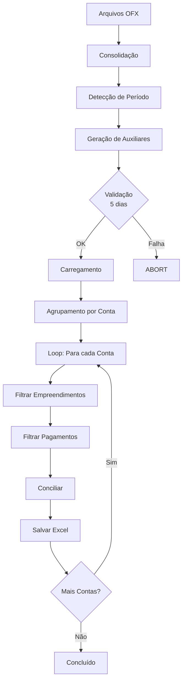

# Sistema de Conciliação Bancária Automatizada

## 📋 Visão Geral

O sistema foi completamente refatorado para automatizar a conciliação bancária em lote, processando múltiplas contas bancárias de forma independente.

## 🏗️ Estrutura de Diretórios

```
Vivencie/
├── src/
│   ├── consilia_extrato.py          # Script principal de conciliação (REFATORADO)
│   ├── automatizador_final.py       # Gera relatório de contas pagas
│   ├── capturador_pessoas.py        # Captura cadastro de pessoas
│   └── capturador_bancos.py         # Captura dados bancários
├── ofx_a_processar/                 # COLOQUE AQUI os arquivos .ofx
├── arquivos_auxiliares/             # Arquivos gerados automaticamente
│   ├── relatorio_contas_pagas.csv
│   ├── pessoas_cadastradas.csv
│   └── bancos.csv
└── relatorios/                      # Relatórios de conciliação gerados
    └── conciliacao_[banco]_[agencia]_[conta].xlsx
```

## 🚀 Como Usar

### 1. Preparação

1. **Coloque os arquivos OFX** na pasta `ofx_a_processar/`
   - Aceita múltiplos arquivos .ofx
   - Cada arquivo será processado automaticamente

2. **Configure as credenciais** no arquivo `.env`:
   ```env
   ACADE_USUARIO=seu_usuario
   ACADE_SENHA=sua_senha
   ACADE_BASE_URL=https://martins.acadeone.com.br
   ```

### 2. Execução

Execute o script principal:

```bash
python src/consilia_extrato.py
```

### 3. O que acontece automaticamente

O sistema executa 4 etapas principais:

#### **ETAPA 1: Carregamento de Arquivos OFX**
- Varre a pasta `ofx_a_processar/`
- Lista todos os arquivos `.ofx`
- Extrai dados de cada conta (banco, agência, conta)
- Consolida todas as transações em um único DataFrame

#### **ETAPA 2: Preparação de Arquivos Auxiliares**
- Detecta o período de datas dos extratos OFX
- Executa automaticamente:
  - `automatizador_final.py` → gera `relatorio_contas_pagas.csv`
  - `capturador_pessoas.py` → gera `pessoas_cadastradas.csv`
  - `capturador_bancos.py` → gera `bancos.csv`
- **Valida idade dos arquivos**: devem ter no máximo 5 dias
- Se algum arquivo estiver desatualizado ou ausente, o processo é **abortado**

#### **ETAPA 3: Carregamento de Dados Auxiliares**
- Carrega os 3 arquivos CSV gerados
- Valida integridade dos dados

#### **ETAPA 4: Processamento em Lotes**
Para cada conta bancária encontrada nos arquivos OFX:

1. **Identifica empreendimentos** vinculados à conta (via `bancos.csv`)
2. **Filtra pagamentos** relacionados aos empreendimentos
3. **Executa conciliação** usando algoritmo de score ponderado:
   - Score de Valor (40%)
   - Score de Data (30%)
   - Score de Texto/Nome (30%)
   - Limite de confiança: 70%
4. **Gera relatório Excel** individual com 3 abas:
   - **Conciliados**: Pagamentos encontrados (formatação condicional)
   - **Pagtos_Nao_Encontrados**: Pagamentos sem débito bancário
   - **Debitos_Nao_Encontrados**: Débitos sem registro de pagamento

## 📊 Arquivos de Saída

Cada conta bancária gera um arquivo Excel:

```
relatorios/conciliacao_[codigo]_[agencia]_[conta].xlsx
```

**Exemplo:**
```
relatorios/conciliacao_001_1234_12345-6.xlsx
```

### Formatação Profissional

- ✅ **Auto-ajuste de colunas** (largura automática)
- ✅ **Filtros automáticos** em todas as abas
- ✅ **Formatação condicional** na coluna ATENÇÃO:
  - 🟢 Verde: "OK" (conciliação perfeita)
  - 🔴 Vermelho: "DATA", "VALOR" ou "DT e VR" (divergências)

## ⚙️ Parâmetros de Conciliação

Configurados no início do script:

```python
TOLERANCIA_VALOR_REAIS = Decimal(10.0)  # ±R$ 10,00
TOLERANCIA_DIAS = 5                      # ±5 dias
PESO_VALOR = 0.40                        # 40%
PESO_DATA = 0.30                         # 30%
PESO_TEXTO = 0.30                        # 30%
LIMITE_CONFIANCA = 0.70                  # 70%
```

## 🔄 Fluxo de Dados



## 📝 Regras de Negócio

### Validação de Arquivos Auxiliares
- Arquivos devem existir em `arquivos_auxiliares/`
- Idade máxima: **5 dias**
- Se inválidos, o processo é **abortado** com mensagem clara

### Identificação de Empreendimentos
- Usa dados do arquivo `bancos.csv`
- Busca exata por: `codigo`, `agencia`, `conta`
- Extrai lista única da coluna `empreendimentos`

### Filtro de Pagamentos
- Filtra `relatorio_contas_pagas.csv`
- Critério: coluna `Centro Custo` deve estar na lista de empreendimentos

### Algoritmo de Conciliação
- Compara cada pagamento com cada débito bancário
- Calcula 3 scores: valor, data, texto
- Pondera scores conforme pesos definidos
- Aceita match se score final ≥ limite de confiança
- Evita duplicatas (1 pagamento = 1 débito)

## 🛠️ Manutenção

### Alterar Período de Validação
Edite a linha 177 em `consilia_extrato.py`:
```python
limite_data = datetime.now() - timedelta(days=5)  # Altere 5 para o valor desejado
```

### Ajustar Parâmetros de Conciliação
Edite as constantes nas linhas 303-309:
```python
TOLERANCIA_VALOR_REAIS = Decimal(10.0)
TOLERANCIA_DIAS = 5
PESO_VALOR = 0.40
PESO_DATA = 0.30
PESO_TEXTO = 0.30
LIMITE_CONFIANCA = 0.70
```

## ⚠️ Troubleshooting

### "ERRO: Nenhum arquivo .ofx encontrado"
- Verifique se os arquivos estão na pasta `ofx_a_processar/`
- Confirme se a extensão é `.ofx` (minúscula)

### "ERRO: ARQUIVOS AUXILIARES INVÁLIDOS"
- Execute manualmente os scripts auxiliares
- Ou aguarde até que os arquivos sejam gerados automaticamente

### "Conta não encontrada no cadastro de bancos"
- Execute `capturador_bancos.py` para atualizar o cadastro
- Verifique se o banco/agência/conta existe no sistema ACADE

### "Nenhum pagamento encontrado para estes empreendimentos"
- Verifique se a coluna `Centro Custo` está preenchida em `relatorio_contas_pagas.csv`
- Confirme se os empreendimentos estão corretamente vinculados no `bancos.csv`

## 📦 Dependências

As seguintes bibliotecas são necessárias (já estão no `requirements.txt`):

```
pandas>=2.1.0
fuzzywuzzy>=0.18.0
ofxparse>=0.21
openpyxl>=3.1.0
python-dotenv>=1.0.1
selenium>=4.23.0
webdriver-manager>=4.0.1
```

## 🎯 Vantagens da Refatoração

✅ **Processamento em Lote**: Uma conta por vez, independente  
✅ **Automação Completa**: Zero intervenção manual  
✅ **Validação Robusta**: Garante dados atualizados  
✅ **Múltiplas Contas**: Processa quantas contas existirem nos OFX  
✅ **Relatórios Isolados**: Um arquivo Excel por conta bancária  
✅ **Formatação Profissional**: Pronto para apresentação  
✅ **Manutenibilidade**: Código modular e bem documentado  

---

**Desenvolvido por:** Equipe Vivencie  
**Última Atualização:** 29 de outubro de 2025
